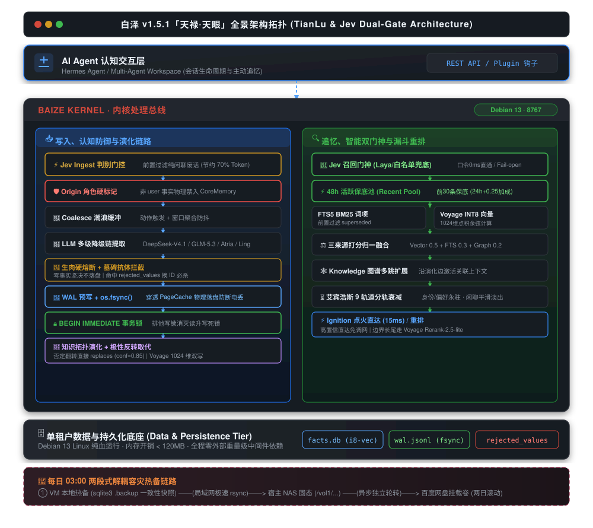

<div align="center">

# 🏛️ 白泽 (Bai Ze)

### 面向 AI Agent 的私有持久化思想引擎 · 生产就绪级长期记忆中枢
**Full-Stack Free, Self-Evolving, High-Reliability Private Thought Engine for AI Agents**

[](LICENSE)
[](https://python.org)
[](https://fastapi.tiangolo.com)
[](https://github.com/TIANXT97/baize)
[](#)

</div>

---

## 📖 项目简介 (Overview)

**白泽（Bai Ze）** 是一套专为长生命周期 AI Agent（如 Hermes Agent 等）设计的**全功能私有化持久思想引擎（Thought Engine）**。

它坚决拒绝传统记忆方案中“无脑向量堆积、断电即丢、检索无序、长上下文费用失控”的痼疾，深度融合了**艾宾浩斯分轨遗忘衰减、知识拓扑演化建边、意图门控、潮浪波次防抖聚合、双模型混合检索（FTS5 + Voyage int8 向量 + 图谱多跳）、WAL 预写日志死信熔断与两段式灾备**。

> **核心哲学**：  
> *“记忆不是堆积，而是筛选；遗忘不是缺陷，而是智慧；思想不是存储，而是编织。”*

---

## ✨ 核心特性 (Key Features)

- 🛡️ **四道认知防御铁壁 (Cognitive Defense & Tombstone)**：
  - **Origin 身份硬隔离**：解析输入角色打标，非用户亲陈事实在代码层物理剥夺进入 `user_profile` 权限，彻底杜绝大模型推测被洗白为永久画像；
  - **极性反转直接取代**：长句否定纠错直接判定 `replaces`（置信度 0.85），彻底破除 Jaccard 线性稀释与数学脑死亡；
  - **被否决事实墓碑表 (rejected_values)**：废弃旧事实 SHA-256 铸入墓碑，换 ID 或微调语序也 100% 物理拦截，严防借尸还魂；
  - **生肉回灌硬熔断**：提取返回空时坚决零落盘，超过 250 字符或含角色动作描写的文本绝对拒签。
- ⚡ **工业级排他事务与物理落盘 (P0 存储加固 · 天禄核心)**：
  - `get_db(write=True)` 引入 **`BEGIN IMMEDIATE`** 提前抢占写锁，从根源消灭并发读升写的 `SQLITE_BUSY` 死锁；
  - `wal.py` 写入后注入内核级 **`os.fsync()`**，确保应用层预写日志物理落盘，免疫硬件断电与 OOM 强杀。
- 🌊 **活跃记忆时效保底池 (Recent Pool & Over-fetching)**：初筛过采样扩容至 100 条，并新增 48 小时前 30 条关键事实保底池（权重 0.4 保底 + 24h 内 +0.25 显式加权），根除最新决议被历史词频淹没的顽疾。
- ⏳ **9 轨道艾宾浩斯遗忘衰减 (9-Lane Ebbinghaus Decay)**：
  - `identity`（身份）、`preference`（偏好）：**永久零衰减**；
  - `rule`（铁律）、`procedural`（经验）、`knowledge`（知识）：缓慢衰减；
  - `emotion`（情绪）、`general`（过渡闲聊）：平滑快速淡出。
- 🔍 **追忆漏斗全链路透视 (Recall Funnel · search_trace)**：开放 `POST /search_trace` 端点，FTS、向量、图谱、衰减与重排五阶段耗时与候选淘汰明明白白，彻底告别“搜不到”的黑盒。
- 🌉 **上下文压缩桥接 (Compaction Bridge)**：Hermes Agent 压缩丢弃长历史前，规则式提取工具输出与关键事实通过 `/api/ingest` 归档并**全量补齐 1024 维 Voyage 语义向量**，根除向量黑洞。

---

## 🏗️ 架构拓扑 (Architecture)

<div align="center">
  
</div>

<details>
<summary><b>🔍 点击展开 ASCII 文本架构拓扑</b></summary>

```
        ┌────────────────────────────────────────────────────────┐
        │                 AI Agent 认知交互层                     │
        └───────────────────────────┬────────────────────────────┘
                                    │
                         REST API / Plugin 钩子
                                    │
                                    ▼
┌────────────────────────────────────────────────────────────────────────┐
│                   白泽 v1.5.0「天禄」内核架构 (TianLu)                 │
│                                                                        │
│  ┌──────────────────────┐              ┌────────────────────────────┐  │
│  │     写入与演化链路   │              │        追忆与检索链路      │  │
│  │                      │              │                            │  │
│  │  Origin 角色硬标记   │              │  MemoryGate 意图门控       │  │
│  │  (用户/助手身份隔离) │              │             │              │  │
│  │         │            │              │  48h 活跃记忆保底初筛池    │  │
│  │  Coalesce 潮浪缓冲   │              │  (Recent Pool + 显式时效)  │  │
│  │         │            │              │             │              │  │
│  │  LLM 双链高可用提取  │              │  FTS5 词项召回 (BM25)      │  │
│  │  (实体主语强约束补全)│              │  (前置过滤 superseded)     │  │
│  │         │            │              │             │              │  │
│  │  生肉长文本硬熔断    │              │  Voyage 向量余弦 (int8)    │  │
│  │  (零事实坚决不落盘)  │              │             │              │  │
│  │         │            │              │  三来源打分量纲归一融合    │  │
│  │  墓碑抗体比对过滤    │              │             │              │  │
│  │  (rejected_values)   │              │  Knowledge 图谱多跳扩展    │  │
│  │         │            │              │             │              │  │
│  │  WAL 预写 + os.fsync │              │  Ebbinghaus 9 轨道遗忘衰减 │  │
│  │  (物理强制落盘防丢)  │              │             │              │  │
│  │         │            │              │  Ignition 点火高置信直达   │  │
│  │  BEGIN IMMEDIATE 锁  │              │             │              │  │
│  │  (消灭读升写死锁)    │              │  Cross-Encoder 潮汐重排    │  │
│  │         │            │              │             │              │  │
│  │  极性反转演化取代    │              │  search_trace 追忆透视全开 │  │
│  └──────────────────────┘              └────────────────────────────┘  │
│                                                                        │
│  ┌──────────────────────────────────────────────────────────────────┐  │
│  │                         数据与持久化底座                         │  │
│  │  facts.db (SQLite-vec) · wal.jsonl (物理fsync) · Debian 13 原生  │  │
│  └──────────────────────────────────────────────────────────────────┘  │
└───────────────────────────────────┬────────────────────────────────────┘
                                    │
                       每日 03:00 两段式解耦热备
                                    │
                                    ▼
    ┌───────────────────────────────┴───────────────────────────────┐
    │ 宿主本地固态 (/vol1/...)  ──>  百度网盘挂载卷 (两日滚动轮转)   │
    └───────────────────────────────────────────────────────────────┘
```

</details>

---

## 🚀 快速启动 (Quick Start)

### 1. 环境准备与安装
```bash
git clone https://github.com/TIANXT97/baize.git
cd baize

# 推荐 Python 3.11+ 虚拟环境
python3 -m venv venv
source venv/bin/activate

pip install -r requirements.txt
```

### 2. 配置环境变量
```bash
cp .env.example .env
# 编辑填入你的 API Key (提取器支持主/备双链自动降级，任意 OpenAI 兼容端点均可；
# 例：主用免费羊毛模型 + 备用 Ling-3.0-flash(百灵) / Voyage AI 200M 免费额度做向量)
```

### 3. 启动服务
```bash
uvicorn api_server:app --host 127.0.0.1 --port 8767
```

### 4. 验证服务状态
```bash
curl http://127.0.0.1:8767/health
```
返回 `status: ok` 且 6 大模块、5 大探针全绿即代表就绪！

---

## 🔌 接入 Hermes Agent

白泽提供了原生 Hermes MemoryProvider 插件。只需将 `plugin/baize` 拷贝至 Hermes 插件目录：
```bash
cp -r plugin/baize ~/.hermes/plugins/
```
在 Hermes 配置文件 `config.yaml` 中启用：
```yaml
memory:
  provider: baize
```

---

## 📚 详细技术文档 (Documentation)

- 📜 [白泽 v1.5.0 完整技术白皮书（天禄现役版）](docs/whitepaper.md) — 核心系统架构、认知防线与存储规范
- 📜 [全景演进与架构审计编年史](docs/CHANGELOG.md) — 涵盖 v1.0 至 v1.5.0 完整演进历史与历次架构审计结论

---

## 📄 开源许可证 (License)

本项目基于 [MIT License](LICENSE) 协议开源。
